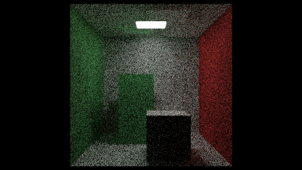

# Haskell Raytracing

[](https://www.haskell.org/)
[](LICENSE)
[](https://cabal.readthedocs.io/)

A high-performance ray tracing renderer implemented in Haskell, inspired by [Peter Shirley's "Ray Tracing In One Weekend"](https://raytracing.github.io/books/RayTracingInOneWeekend.html). This project demonstrates advanced functional programming concepts while producing stunning photorealistic images.



## 🌟 Features

### Core Raytracing
- **Path Tracing**: Physically-based rendering with global illumination
- **Multiple Ray Bounces**: Configurable depth for realistic light transport
- **Anti-aliasing**: Multi-sample per pixel for smooth edges
- **Depth of Field**: Realistic camera effects with defocus blur

### Geometric Primitives
- **Spheres**: Static and moving spheres with smooth motion blur
- **Quads**: Planar surfaces for walls, floors, and ceilings
- **Triangles**: Arbitrary triangular surfaces
- **Ellipses**: Elliptical shapes
- **Axis-Aligned Bounding Boxes (AABB)**: Efficient collision detection

### Materials & Textures
- **Lambertian**: Diffuse materials with realistic light scattering
- **Metal**: Reflective surfaces with configurable roughness
- **Dielectric**: Transparent materials (glass, water) with refraction
- **Diffuse Light**: Emissive materials for light sources
- **Checker Pattern**: Procedural checkerboard textures
- **Perlin Noise**: Procedural noise textures
- **Image Textures**: Realistic textures from image files
- **Solid Colors**: Simple uniform color materials

### Performance Optimizations
- **Bounding Volume Hierarchy (BVH)**: Fast spatial partitioning for ray-object intersections
- **Multi-threading**: Parallel rendering for improved performance
- **Progress Tracking**: Real-time rendering progress display
- **Memory Efficient**: Optimized data structures and algorithms

### Scene Examples
- **Final Scene**: Complex scene with multiple materials and objects
- **Perlin Spheres**: Procedural noise-based scene
- **Quads Scene**: Architectural scene with planar surfaces
- **Simple Light**: Basic lighting demonstration
- **Cornell Box**: Classic computer graphics test scene
- **Earth Scene**: Realistic Earth texture mapping

## 📋 Prerequisites

- **GHC (Glasgow Haskell Compiler)**: Version 8.10 or later
- **Cabal**: Version 3.0 or later
- **System Libraries**: Standard C libraries for image processing

### Installation on Windows

1. **Install GHC and Cabal**:
   - Download from [Haskell Platform](https://www.haskell.org/platform/) or
   - Use [GHCup](https://www.haskell.org/ghcup/): `ghcup install ghc cabal`

2. **Verify Installation**:
   ```bash
   ghc --version
   cabal --version
   ```

## 🚀 Quick Start

### Building the Project

1. **Clone the repository**:
   ```bash
   git clone https://github.com/Slowyn/haskell-raytracing.git
   cd haskell-raytracing
   ```

2. **Build the project**:
   ```bash
   cabal build
   ```

3. **Run the renderer**:
   ```bash
   cabal run
   ```

### Configuration

The renderer supports various configuration options in `app/Main.hs`:

```haskell
-- Image settings
width = 512                    -- Image width in pixels
aspectRatio = 16.0 / 9.0      -- Aspect ratio
samplesPerPixel = 200         -- Anti-aliasing samples
maxDepth = 50                 -- Maximum ray bounce depth

-- Scene selection (0-5)
selectedScene = 4             -- Choose from available scenes
```

### Available Scenes

- `0`: Final Scene - Complex multi-object scene
- `1`: Perlin Spheres - Procedural noise scene
- `2`: Quads Scene - Architectural scene
- `3`: Simple Light - Basic lighting demo
- `4`: Cornell Box - Classic test scene
- `5`: Earth Scene - Earth texture mapping

## 🏗️ Project Structure

```
haskell-raytracing/
├── app/
│   ├── Main.hs              # Main application entry point
│   ├── Lib.hs               # Core library module
│   ├── Vec3.hs              # 3D vector mathematics
│   ├── Ray.hs               # Ray representation and operations
│   ├── Camera.hs            # Camera and projection system
│   ├── Hittable.hs          # Ray-object intersection interface
│   ├── HitRecord.hs         # Intersection data structure
│   ├── Material.hs          # Material system interface
│   ├── Texture.hs           # Texture system interface
│   ├── Bvh.hs               # Bounding Volume Hierarchy
│   ├── Scene.hs             # Scene management
│   ├── Materials/           # Material implementations
│   │   ├── Lambertian.hs    # Diffuse materials
│   │   ├── Metal.hs         # Reflective materials
│   │   ├── Dielectric.hs    # Transparent materials
│   │   └── DiffuseLight.hs  # Emissive materials
│   ├── Shapes/              # Geometric primitives
│   │   ├── Sphere.hs        # Spherical objects
│   │   ├── Quad.hs          # Planar surfaces
│   │   ├── Tri.hs           # Triangular surfaces
│   │   └── Ellipse.hs       # Elliptical shapes
│   └── Textures/            # Texture implementations
│       ├── SolidColor.hs    # Uniform color textures
│       ├── Checker.hs       # Checkerboard patterns
│       ├── Perlin.hs        # Noise textures
│       └── Image.hs         # Image-based textures
├── assets/                  # Texture assets
│   └── earthmap.jpg         # Earth texture map
├── haskell-raytracing.cabal # Project configuration
└── README.md               # This file
```

## 🔧 Dependencies

The project uses the following key Haskell libraries:

- **JuicyPixels**: Image processing and format support
- **random**: High-quality random number generation
- **mtl**: Monad transformers for state management
- **vector**: Efficient array operations
- **massiv**: Multi-dimensional arrays
- **terminal-progress-bar**: Progress tracking during rendering

## 🎨 Rendering Examples

The renderer produces high-quality images with realistic lighting, materials, and effects. Each scene demonstrates different aspects of the ray tracing engine:

- **Realistic Materials**: Metal, glass, and diffuse surfaces
- **Global Illumination**: Light bouncing between objects
- **Soft Shadows**: Natural shadow falloff
- **Motion Blur**: Realistic camera effects
- **Depth of Field**: Cinematic focus effects

## 🚀 Performance

The renderer is optimized for performance with:

- **Multi-threaded rendering** for CPU utilization
- **BVH acceleration** for fast ray-object intersections
- **Memory-efficient algorithms** for large scenes
- **Progress tracking** for long renders

Typical render times vary by scene complexity and settings:
- Simple scenes: 1-5 minutes
- Complex scenes: 10-30 minutes
- High-quality renders: 1-2 hours

## 🤝 Contributing

Contributions are welcome! Please feel free to submit a Pull Request. For major changes, please open an issue first to discuss what you would like to change.

### Development Setup

1. **Fork the repository**
2. **Create a feature branch**: `git checkout -b feature/amazing-feature`
3. **Make your changes** and test thoroughly
4. **Commit your changes**: `git commit -m 'Add amazing feature'`
5. **Push to the branch**: `git push origin feature/amazing-feature`
6. **Open a Pull Request**

## 📄 License

This project is licensed under the MIT License - see the [LICENSE](LICENSE) file for details.

## 🙏 Acknowledgments

- **Peter Shirley** for the excellent "Ray Tracing In One Weekend" series
- **Haskell Community** for the amazing ecosystem of libraries
- **Contributors** who have helped improve this project

## 📞 Contact

- **Author**: Konstantin Iakushin
- **Email**: iakushin.konstantin@gmail.com
- **GitHub**: [@Slowyn](https://github.com/Slowyn)

---

**Happy Raytracing!** 🎨✨
